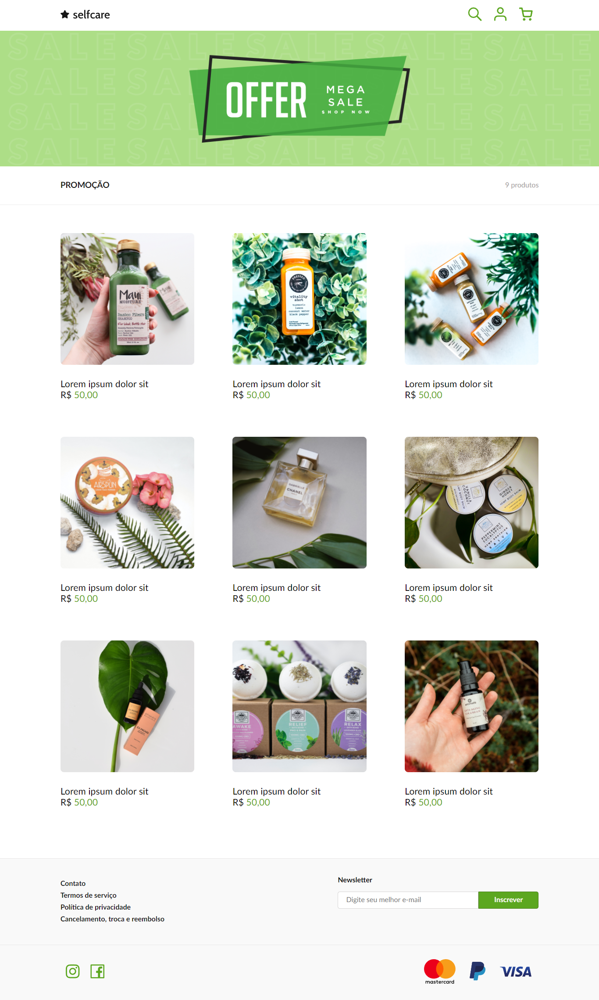

<h1 align="center">Selfcare Devchallenge </h1>

## Desafio 🎯
<p>
  Desenvolver a página de acordo com o layout, aproximando o máximo possível do fornecido no desafio.
</p>


## Tecnologias 🚀

- HTML
- Scss

<br>

## Screenshots 📸

<br>

<p>
  Fornecido pelo desafio:
</p>
<p align="center">
  
</p>

<p>
  Resultado final:
</p>
<p align="center">
  
</p>

<p>
  Fornecido pelo desafio:
</p>

<p align="center">
  
</p>

<p>
  Resultado final:
</p>

<p align="center">
  
</p>

<br>

## Como rodar ❓

```bash

git clone https://github.com/d3vnicolas/selfcare.git

cd selfcare

duplo clique no index.html

```

##  Contribua comigo 🤗

<br>

- Faça um fork desse repositório.
- Marque com star.
- Entre em contato para dúvidas ou sugestões.

<br>
<br>

##  Desenvolvedor 👨🏽‍💻

<table align="center">
    <tr>
        <td align="center">
            <a href="https://github.com/d3vnicolas">
                
            </a>
        </td>    
    </tr>
</table>
<h3 align="center">
   Feito com ❤️ por:  <a href="https://www.linkedin.com/in/nicolas-soares-887655220/" target="_blank"> Nicolas Soares </a>
</h3>


